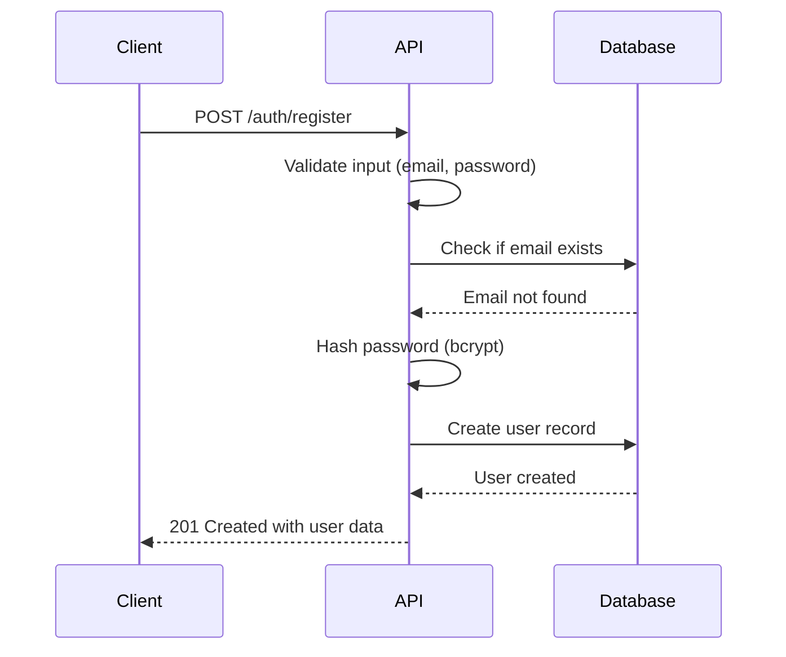
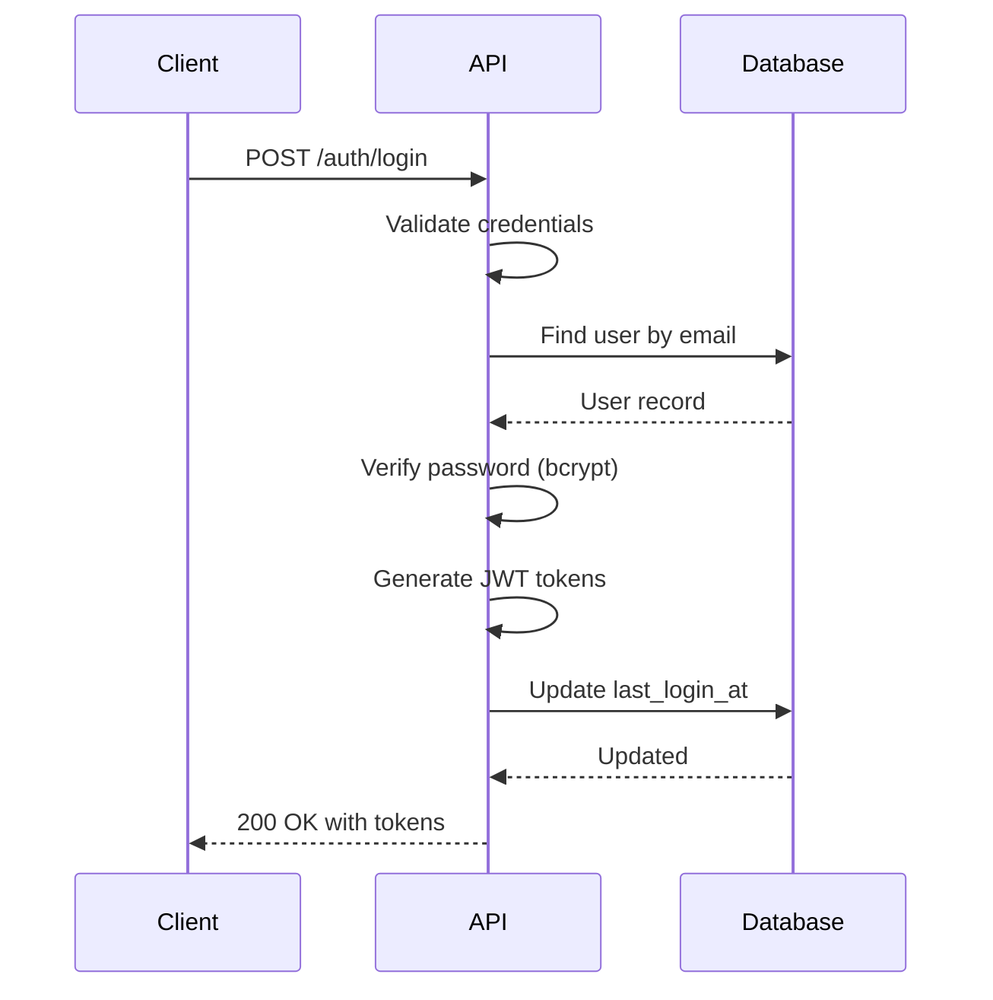
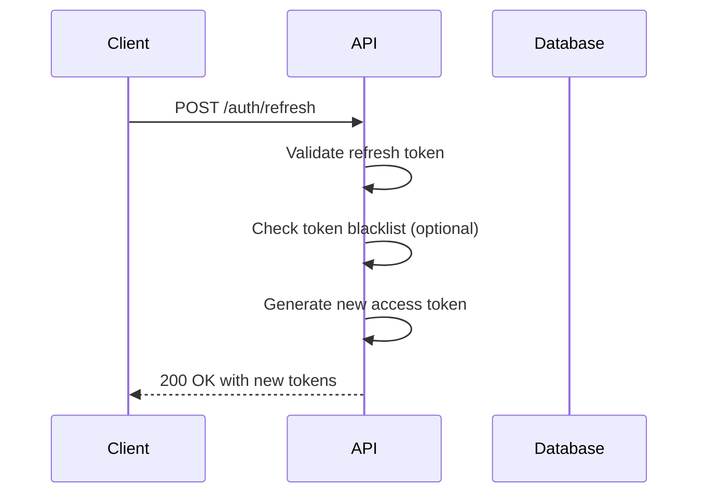

# Authentication and Authorization Strategy

## Overview

The URL shortener service implements a multi-layered authentication and authorization system supporting:
1. **User Authentication** - Email/password with JWT tokens
2. **API Key Authentication** - Programmatic access with rate limiting
3. **Role-Based Access Control (RBAC)** - User, Admin roles
4. **Resource-Level Authorization** - Ownership-based access control

## Authentication Flows

### 1. User Registration Flow


### 2. User Login Flow


### 3. Token Refresh Flow


## JWT Token Implementation

### Token Structure

#### Access Token (short-lived)
```json
{
  "header": {
    "alg": "HS256",
    "typ": "JWT"
  },
  "payload": {
    "sub": "550e8400-e29b-41d4-a716-446655440000",
    "email": "user@example.com",
    "name": "John Doe",
    "is_admin": false,
    "iat": 1612345678,
    "exp": 1612346578,  // 15 minutes
    "jti": "token-id-123"
  },
  "signature": "HMACSHA256(...)"
}
```

#### Refresh Token (long-lived)
```json
{
  "payload": {
    "sub": "550e8400-e29b-41d4-a716-446655440000",
    "type": "refresh",
    "iat": 1612345678,
    "exp": 1612950478,  // 7 days
    "jti": "refresh-id-456"
  }
}
```

### Token Configuration
```go
type TokenConfig struct {
    AccessTokenExpiry  time.Duration // 15 minutes
    RefreshTokenExpiry time.Duration // 7 days
    JWTSecret          string        // 32+ byte secret
    Issuer             string        // "url-shortener"
}
```

### Token Generation
```go
func GenerateTokens(user *models.User) (*TokenPair, error) {
    // Access token
    accessClaims := jwt.MapClaims{
        "sub":      user.ID.String(),
        "email":    user.Email,
        "name":     user.Name,
        "is_admin": user.IsAdmin,
        "iat":      time.Now().Unix(),
        "exp":      time.Now().Add(config.AccessTokenExpiry).Unix(),
        "jti":      uuid.New().String(),
        "type":     "access",
    }
    
    accessToken := jwt.NewWithClaims(jwt.SigningMethodHS256, accessClaims)
    signedAccess, err := accessToken.SignedString([]byte(config.JWTSecret))
    
    // Refresh token
    refreshClaims := jwt.MapClaims{
        "sub":  user.ID.String(),
        "type": "refresh",
        "iat":  time.Now().Unix(),
        "exp":  time.Now().Add(config.RefreshTokenExpiry).Unix(),
        "jti":  uuid.New().String(),
    }
    
    refreshToken := jwt.NewWithClaims(jwt.SigningMethodHS256, refreshClaims)
    signedRefresh, err := refreshToken.SignedString([]byte(config.JWTSecret))
    
    return &TokenPair{
        AccessToken:  signedAccess,
        RefreshToken: signedRefresh,
        ExpiresIn:    int(config.AccessTokenExpiry.Seconds()),
    }, nil
}
```

## Password Security

### Hashing Strategy
- **Algorithm**: bcrypt with cost factor 12
- **Salt**: Automatically generated by bcrypt
- **Verification**: Constant-time comparison

```go
func HashPassword(password string) (string, error) {
    bytes, err := bcrypt.GenerateFromPassword([]byte(password), 12)
    return string(bytes), err
}

func CheckPasswordHash(password, hash string) bool {
    err := bcrypt.CompareHashAndPassword([]byte(hash), []byte(password))
    return err == nil
}
```

### Password Policy
```go
type PasswordPolicy struct {
    MinLength          int  // 8
    RequireUppercase   bool // true
    RequireLowercase   bool // true
    RequireNumbers     bool // true
    RequireSpecial     bool // true
    MaxRepeatedChars   int  // 3
    CommonPasswords    []string // ["password", "123456", ...]
}

func ValidatePassword(password string, policy PasswordPolicy) error {
    if len(password) < policy.MinLength {
        return errors.New("password too short")
    }
    // ... additional validations
}
```

## API Key Authentication

### Key Generation
```go
func GenerateAPIKey(userID uuid.UUID, name string) (*APIKey, error) {
    // Generate random key
    rawKey := "sk_" + base64.RawURLEncoding.EncodeToString(randomBytes(32))
    
    // Hash for storage (never store raw key)
    keyHash := sha256.Sum256([]byte(rawKey))
    hashedKey := hex.EncodeToString(keyHash[:])
    
    apiKey := &models.APIKey{
        ID:       uuid.New(),
        UserID:   userID,
        KeyHash:  hashedKey,
        Name:     name,
        RateLimit: 1000,
        CreatedAt: time.Now(),
    }
    
    // Store only the hash
    err := repo.CreateAPIKey(apiKey)
    
    // Return raw key only once
    return &APIKey{
        Key:       rawKey,
        KeyPrefix: rawKey[:8],
        Name:      name,
        CreatedAt: apiKey.CreatedAt,
    }, nil
}
```

### Key Validation
```go
func ValidateAPIKey(apiKey string) (*models.User, error) {
    // Hash the provided key
    keyHash := sha256.Sum256([]byte(apiKey))
    hashedKey := hex.EncodeToString(keyHash[:])
    
    // Look up in database
    storedKey, err := repo.GetAPIKeyByHash(hashedKey)
    if err != nil {
        return nil, errors.New("invalid API key")
    }
    
    // Check expiration
    if storedKey.ExpiresAt != nil && storedKey.ExpiresAt.Before(time.Now()) {
        return nil, errors.New("API key expired")
    }
    
    // Update last used
    storedKey.LastUsedAt = time.Now()
    repo.UpdateAPIKey(storedKey)
    
    // Get user
    user, err := repo.GetUserByID(storedKey.UserID)
    return user, nil
}
```

## Authorization System

### Role-Based Access Control (RBAC)

#### Roles
```go
type Role string

const (
    RolePublic   Role = "public"
    RoleUser     Role = "user"
    RoleAdmin    Role = "admin"
    RoleSystem   Role = "system"
)

type Permission string

const (
    PermissionCreateLink   Permission = "links:create"
    PermissionReadLink     Permission = "links:read"
    PermissionUpdateLink   Permission = "links:update"
    PermissionDeleteLink   Permission = "links:delete"
    PermissionCreateDomain Permission = "domains:create"
    PermissionReadAnalytics Permission = "analytics:read"
    PermissionManageUsers  Permission = "users:manage"
    PermissionSystemConfig Permission = "system:config"
)

// Role-Permission mapping
var RolePermissions = map[Role][]Permission{
    RolePublic: {
        PermissionReadLink, // Public can view link info
    },
    RoleUser: {
        PermissionCreateLink,
        PermissionReadLink,
        PermissionUpdateLink,
        PermissionDeleteLink,
        PermissionCreateDomain,
        PermissionReadAnalytics,
    },
    RoleAdmin: {
        PermissionCreateLink,
        PermissionReadLink,
        PermissionUpdateLink,
        PermissionDeleteLink,
        PermissionCreateDomain,
        PermissionReadAnalytics,
        PermissionManageUsers,
        PermissionSystemConfig,
    },
}
```

### Resource-Level Authorization

#### Ownership-Based Access
```go
func AuthorizeLinkAccess(user *models.User, link *models.Link, permission Permission) error {
    // Admin can do anything
    if user.IsAdmin {
        return nil
    }
    
    // Check ownership
    if link.UserID != user.ID {
        return errors.New("not authorized to access this resource")
    }
    
    // Check if user has permission for this action
    if !hasPermission(user.Role, permission) {
        return errors.New("insufficient permissions")
    }
    
    // Additional business rules
    if permission == PermissionDeleteLink && link.ClickCount > 1000 {
        return errors.New("cannot delete popular links")
    }
    
    return nil
}
```

### Middleware Implementation

#### Authentication Middleware
```go
func AuthMiddleware(jwtSecret string) gin.HandlerFunc {
    return func(c *gin.Context) {
        // Try JWT first
        authHeader := c.GetHeader("Authorization")
        if authHeader != "" {
            user, err := validateJWT(authHeader, jwtSecret)
            if err == nil {
                c.Set("user", user)
                c.Set("auth_method", "jwt")
                c.Next()
                return
            }
        }
        
        // Try API key
        apiKey := c.GetHeader("X-API-Key")
        if apiKey != "" {
            user, err := validateAPIKey(apiKey)
            if err == nil {
                c.Set("user", user)
                c.Set("auth_method", "api_key")
                c.Next()
                return
            }
        }
        
        // Public access for certain endpoints
        if isPublicEndpoint(c.Request.URL.Path) {
            c.Set("user", nil)
            c.Set("auth_method", "public")
            c.Next()
            return
        }
        
        c.AbortWithStatusJSON(401, gin.H{
            "error":   "authentication_required",
            "message": "Authentication required",
        })
    }
}
```

#### Authorization Middleware
```go
func RequirePermission(permission Permission) gin.HandlerFunc {
    return func(c *gin.Context) {
        user, exists := c.Get("user")
        if !exists || user == nil {
            c.AbortWithStatusJSON(401, gin.H{
                "error":   "authentication_required",
                "message": "Authentication required",
            })
            return
        }
        
        u := user.(*models.User)
        
        // Check role permissions
        if !hasPermission(u.Role, permission) {
            c.AbortWithStatusJSON(403, gin.H{
                "error":   "insufficient_permissions",
                "message": "You don't have permission to perform this action",
            })
            return
        }
        
        c.Next()
    }
}

func RequireOwnership(resourceType string, paramName string) gin.HandlerFunc {
    return func(c *gin.Context) {
        user := c.MustGet("user").(*models.User)
        
        // Admin bypass
        if user.IsAdmin {
            c.Next()
            return
        }
        
        resourceID := c.Param(paramName)
        
        // Verify ownership
        isOwner, err := checkOwnership(user.ID, resourceType, resourceID)
        if err != nil || !isOwner {
            c.AbortWithStatusJSON(403, gin.H{
                "error":   "forbidden",
                "message": "You don't have permission to access this resource",
            })
            return
        }
        
        c.Next()
    }
}
```

## Rate Limiting

### Implementation Strategy

#### Token Bucket Algorithm
```go
type RateLimiter struct {
    store      RateLimitStore
    limits     map[string]RateLimit
}

type RateLimit struct {
    Requests   int           // Number of requests
    Window     time.Duration // Time window
    Burst      int           // Burst capacity
}

var DefaultLimits = map[string]RateLimit{
    "user": {
        Requests: 1000,
        Window:   time.Hour,
        Burst:    100,
    },
    "api_key": {
        Requests: 1000,
        Window:   time.Hour,
        Burst:    100,
    },
    "public": {
        Requests: 100,
        Window:   time.Hour,
        Burst:    10,
    },
    "admin": {
        Requests: 5000,
        Window:   time.Hour,
        Burst:    500,
    },
}
```

#### Rate Limit Middleware
```go
func RateLimitMiddleware(limiter *RateLimiter) gin.HandlerFunc {
    return func(c *gin.Context) {
        var key string
        var limitType string
        
        // Determine rate limit key
        if user, exists := c.Get("user"); exists && user != nil {
            u := user.(*models.User)
            if u.IsAdmin {
                key = "admin:" + u.ID.String()
                limitType = "admin"
            } else {
                key = "user:" + u.ID.String()
                limitType = "user"
            }
        } else if apiKey := c.GetHeader("X-API-Key"); apiKey != "" {
            keyHash := hashAPIKey(apiKey)
            key = "api_key:" + keyHash
            limitType = "api_key"
        } else {
            // IP-based for public endpoints
            ip := c.ClientIP()
            key = "ip:" + ip
            limitType = "public"
        }
        
        // Check rate limit
        allowed, remaining, reset, err := limiter.Allow(key, limitType)
        if err != nil {
            c.AbortWithStatusJSON(500, gin.H{
                "error": "rate_limit_error",
                "message": "Internal server error",
            })
            return
        }
        
        if !allowed {
            c.Header("X-RateLimit-Limit", strconv.Itoa(limiter.GetLimit(limitType)))
            c.Header("X-RateLimit-Remaining", "0")
            c.Header("X-RateLimit-Reset", strconv.FormatInt(reset.Unix(), 10))
            c.Header("Retry-After", strconv.FormatInt(int64(time.Until(reset).Seconds()), 10))
            
            c.AbortWithStatusJSON(429, gin.H{
                "error": "rate_limit_exceeded",
                "message": "Too many requests",
                "retry_after": time.Until(reset).Seconds(),
            })
            return
        }
        
        // Set headers
        c.Header("X-RateLimit-Limit", strconv.Itoa(limiter.GetLimit(limitType)))
        c.Header("X-RateLimit-Remaining", strconv.Itoa(remaining))
        c.Header("X-RateLimit-Reset", strconv.FormatInt(reset.Unix(), 10))
        
        c.Next()
    }
}
```

## Security Measures

### Token Security
1. **Short-lived access tokens** (15 minutes)
2. **Long-lived refresh tokens** (7 days) stored securely
3. **Token blacklisting** for logout (optional, adds statefulness)
4. **JWT secret rotation** every 90 days
5. **HTTPS mandatory** for all token transmission

### API Key Security
1. **Key hashing** before storage (SHA-256)
2. **Key prefixes** for identification (`sk_live_abc123...`)
3. **Rate limiting** per key
4. **Expiration dates** configurable
5. **Revocation capability** immediate

### Session Management
```go
type SessionManager struct {
    store SessionStore
}

func (sm *SessionManager) CreateSession(userID uuid.UUID, deviceInfo string) (*Session, error) {
    session := &Session{
        ID:         uuid.New(),
        UserID:     userID,
        TokenHash:  generateTokenHash(),
        DeviceInfo: deviceInfo,
        ExpiresAt:  time.Now().Add(7 * 24 * time.Hour),
        CreatedAt:  time.Now(),
    }
    
    err := sm.store.Save(session)
    return session, err
}

func (sm *SessionManager) InvalidateAllSessions(userID uuid.UUID) error {
    return sm.store.DeleteByUserID(userID)
}
```

## Audit Logging

### Security Events to Log
```go
type AuditEvent struct {
    ID           uuid.UUID
    UserID       *uuid.UUID
    Action       string      // "login", "logout", "create_link", "delete_link"
    ResourceType string      // "user", "link", "domain"
    ResourceID   *uuid.UUID
    IPAddress    string
    UserAgent    string
    Details      map[string]interface{}
    Timestamp    time.Time
}

// Events to audit:
// - Successful/failed login attempts
// - Password changes
// - API key creation/revocation
// - Sensitive operations (delete, update permissions)
// - Admin actions
```

## Compliance Considerations

### GDPR Compliance
1. **Right to erasure**: User deletion with data anonymization
2. **Data portability**: Export user data in standard format
3. **Consent management**: Clear privacy policy and terms
4. **Data minimization**: Collect only necessary data

### Security Headers
```go
func SecurityHeaders() gin.HandlerFunc {
    return func(c *gin.Context) {
        // Prevent clickjacking
        c.Header("X-Frame-Options", "DENY")
        
        // Prevent MIME type sniffing
        c.Header("X-Content-Type-Options", "nosniff")
        
        // XSS protection
        c.Header("X-XSS-Protection", "1; mode=block")
        
        // HSTS (in production with HTTPS)
        if config.IsProduction {
            c.Header("Strict-Transport-Security", "max-age=31536000; includeSubDomains")
        }
        
        // Content Security Policy
        c.Header("Content-Security-Policy", 
            "default-src 'self'; script-src 'self' 'unsafe-inline'; style-src 'self' 'unsafe-inline'")
        
        // Referrer policy
        c.Header("Referrer-Policy", "strict-origin-when-cross-origin")
        
        c.Next()
    }
}
```

## Testing Authentication

### Test Scenarios
```go
func TestAuthentication(t *testing.T) {
    t.Run("Valid login returns tokens", func(t *testing.T) {
        // Test valid credentials
    })
    
    t.Run("Invalid login returns error", func(t *testing.T) {
        // Test invalid credentials
    })
    
    t.Run("Expired token returns 401", func(t *testing.T) {
        // Test token expiration
    })
    
    t.Run("API key authentication works", func(t *testing.T) {
        // Test API key flow
    })
    
    t.Run("Rate limiting works", func(t *testing.T) {
        // Test rate limit enforcement
    })
    
    t.Run("Authorization prevents access", func(t *testing.T) {
        // Test RBAC enforcement
    })
}
```

## Deployment Considerations

### Secret Management
- **Environment variables** for JWT secret, database passwords
- **Secret rotation** procedures
- **Key management service** (AWS KMS, HashiCorp Vault) for production

### Monitoring and Alerting
- **Failed login attempts** monitoring
- **Suspicious activity** detection (multiple IPs, unusual patterns)
- **Token usage** analytics
- **Rate limit hits** tracking

This comprehensive authentication and authorization strategy provides secure, scalable access control for the URL shortener service while maintaining good user experience and developer ergonomics.